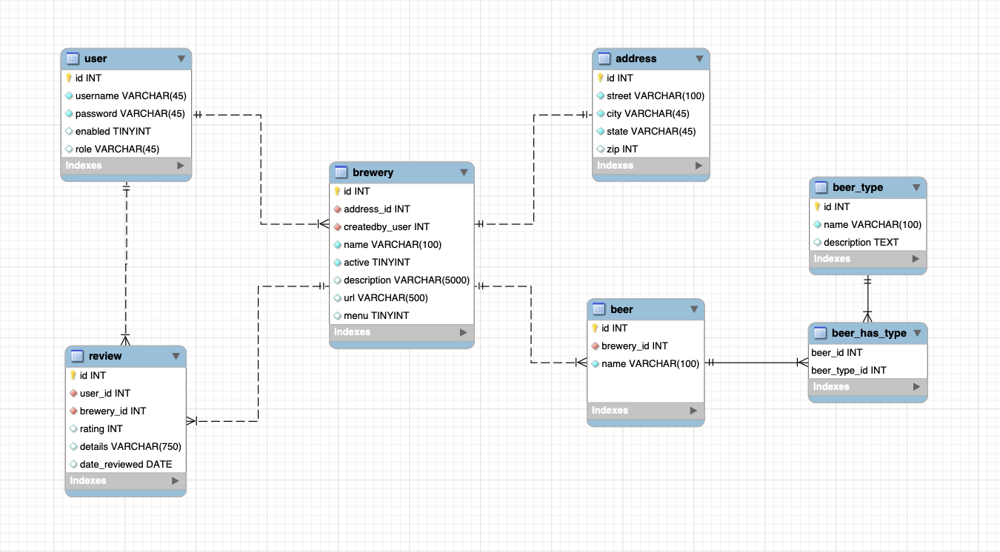

## Deja Brew
SD22 Midterm Project

### Team Curdled Cadaver
* Daniel Bautista (SCRUM Master)
* Paul Lewis (DBA)
* Cody Fulker (Repo Owner)
* Carl Lawson (We're not sure)

### Overview
Deja Brew is a website that provides visitors a list of breweries local to Denver, CO
that provides a list of beers, a map of the location, and allows registered users to
leave ratings and reviews for the establishment.

A user is also able to view a list of their reviews on their user page, and if they
notice that a review was particularly harsh or unfair click on the breweries name
go to that breweries page and delete their personal reviews. Besides leaving reviews
a user is able to create a new brewery that is not on the website yet.

Additionally users with admin privileges are capable of deleting users that are
incapable of playing nice with others.  

### Technologies Used

* Java
* Spring MVC
* JPA/Hibernate/JPQL
* Mysql
* bootstrap
* CSS
* Git
* MAMP
* font-awesome
* Hibernate
* Gradel
* AWS

### Database Schema

### How To Use

Upon getting to the welcome page you are able to look around at the different breweries
available in the Denver area. As a visitor you are also able to click on an individual
brewery and take a look at what they have available and what registered have said about
the brewery. If you wish to leave your own reviews or if you know of a brewery that is
not on the website yet you can register an account by clicking the register button on the
navbar to create your own unique username and password.

### Lessons Learned

### Stretch Goals
* Expand to include all of Colorado
* Have users directly comment on another users comment
* User can add image when creating a new brewery
